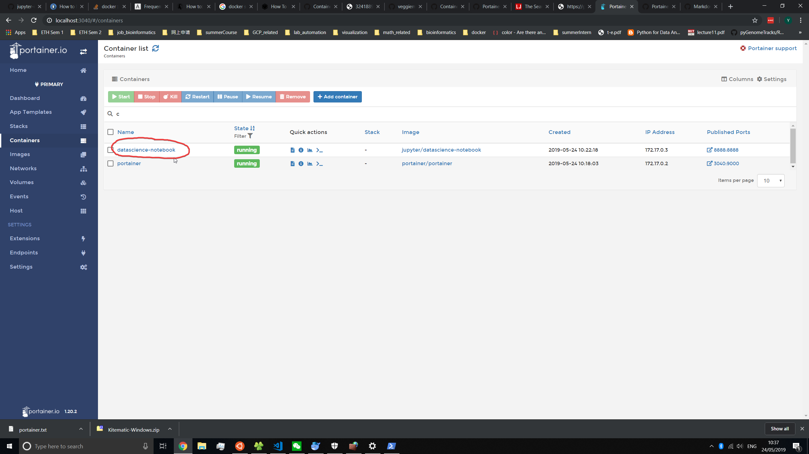
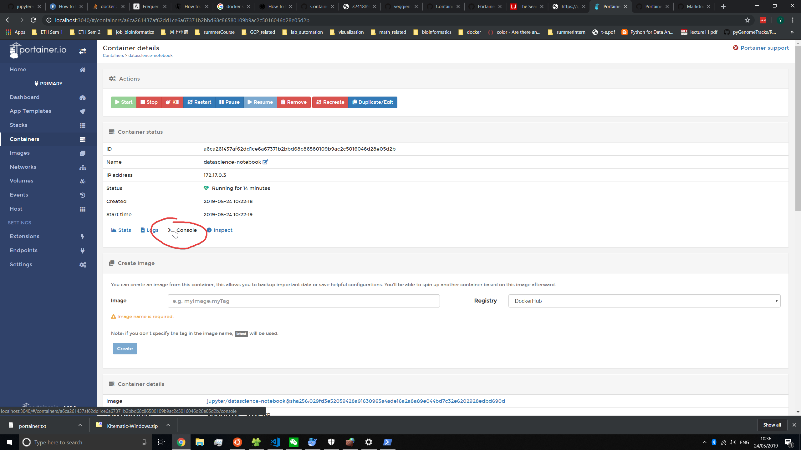

# env-setup

## gitignore

see [here](https://gist.github.com/subfuzion/db7f57fff2fb6998a16c) for details.

```shell
# mac
git config --global core.excludesfile ~/Desktop/github/env-setup/.gitignore
```

## Conda

This may solve the solver issue when installing packages 

## Mac

### Docker 

#### Portainer

Some issues can be resolved. 

Thansk to:
1. https://github.com/docker/kitematic/issues/1010
2. https://github.com/docker/for-mac/issues/770
3. https://github.com/penglongli/blog/issues/68

## Win10

### VS Code remote

Basically, now vs code can attach to a container remotely. But it is also possible for development locally where the docker container runs a relatively stable environment without the need of conda or pip install everytime.

Using the docker from jupyter, the rest of the packages can be installed locally on top of the layers and can also be save through 'commit'.

Ref:
1. https://docs.docker.com/compose/compose-file/ **Remeber to set ENV in windows** `COMPOSE_CONVERT_WINDOWS_PATHS=1`
2. https://code.visualstudio.com/docs/remote/containers args and options can be added when start up

###

https://stackoverflow.com/questions/37100358/docker-compose-exited-with-code-0

### VS Code setting sync

By extension [here](https://marketplace.visualstudio.com/items?itemName=Shan.code-settings-sync)

### Conda (Miniconda)

Install via wsl terminal

```bash
wget https://repo.anaconda.com/miniconda/Miniconda3-latest-Linux-x86_64.sh
bash Miniconda3-latest-Linux-x86_64.sh
conda env create -f myenv.yml
```

Reference:
1. https://gist.github.com/kauffmanes/5e74916617f9993bc3479f401dfec7da
2. https://medium.com/hugo-ferreiras-blog/using-windows-subsystem-for-linux-for-data-science-9a8e68d7610c
3. https://docs.conda.io/en/latest/miniconda.html
### WSL and Docker

follow [here](https://nickjanetakis.com/blog/setting-up-docker-for-windows-and-wsl-to-work-flawlessly) for details.

#### Starting Docker

https://github.com/Paperspace/jupyter-docker-stacks/tree/master/tensorflow-notebook

datascience-notebook and tensorflow-notebook

#### Docker monitor

Using portainer now. Simple use case at this stage look at the setup guide [here](https://gist.github.com/SeanSobey/344edd228922ffd4266ae7d451421ab6)

[Here](./win10/portainer.txt) is the setup files for the network in win10. Should be easier on unix platforms.

But now I can `exec` commands in the container much easier without typing. 






### AHK

1. [How to start up automatically](https://autohotkey.com/docs/FAQ.htm#Startup)
2. `.ahk` under `Autohotkey` [VA](https://github.com/Drugoy/Autohotkey-scripts-.ahk/blob/master/Libraries/VA.ahk)